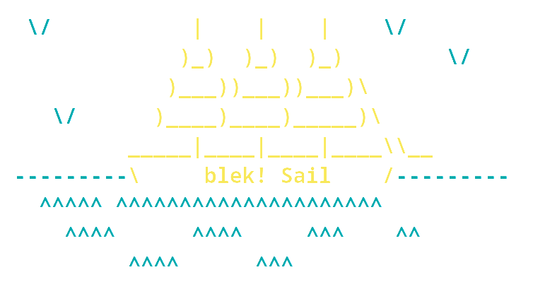

<p align='center'></img></p>

<p align='center'>
    </img>
    </img>
    </img>
</p>

### blek! Sail
blek! Sail is a production-ready alternative to <a href='https://github.com/laravel/sail'>Laravel Sail</a>, which runs on alpine instead of ubuntu and on nginx + php-fpm.

### Starting it up

### Via docker compose (recommended)
```

services:
    sail:
        image: blekii/sail:latest
        build:
            context: directory/with/sail
            dockerfile: Dockerfile
#        volumes:
#            - 'your/project/root:/var/www/html'
#            - 'custom/nginx/config:/etc/nginx'
        ports:
            - '80:80'

```

### Via docker run
```
$ docker run --name sail -p 80:80 -d blekii/sail:latest
```
